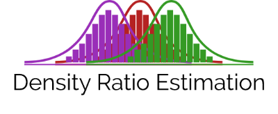

<p align="center">
  <br>
  <a href="https://github.com/JuliaML/DensityRatioEstimation.jl/actions">
    
  </a>
  <a href="https://codecov.io/gh/JuliaML/DensityRatioEstimation.jl">
    
  </a>
  <a href="LICENSE">
    
  </a>
</p>

Given samples `x_nu` and `x_de` from distributions `p_nu` and `p_de`, it is very
useful to estimate the density ratio `r(x) = p_nu(x) / p_de(x)` for all valid `x`.
This problem is known in the literature as the density ratio estimation problem
([Sugiyama et al. 2012](https://www.cambridge.org/core/books/density-ratio-estimation-in-machine-learning/BCBEA6AEAADD66569B1E85DDDEAA7648)).

Naive solutions based on the ratio of individual estimators for numerator and
denominator densities perform poorly, particularly in high dimensions. This
package provides density ratio estimators that perform well with a moderately
large number of dimensions.

## Installation

Get the latest stable release with Julia's package manager:

```julia
] add DensityRatioEstimation
```

## Usage

Given two indexable collections `x_nu` and `x_de` of samples from `p_nu` and
`p_de`, one can estimate the density ratio at all samples in `x_de`:

```julia
using DensityRatioEstimation, Optim

r = densratio(x_nu, x_de, KLIEP(), optlib=OptimLib)
```

The third argument of the `densratio` function is a density ratio estimator.
Currently, this package implements the following estimators:

| Estimator | Type<sup>1</sup> | References |
| --------- | ---- | ---------- |
| Kernel Mean Matching | `KMM`, `uKMM` | [Huang et al. 2006](https://papers.nips.cc/paper/3075-correcting-sample-selection-bias-by-unlabeled-data.pdf) |
| Kullback-Leibler Importance Estimation Procedure | `KLIEP` | [Sugiyama et al. 2008](https://link.springer.com/article/10.1007/s10463-008-0197-x) |
| Least-Squares Importance Fitting | `LSIF` | [Kanamori et al. 2009](http://www.jmlr.org/papers/volume10/kanamori09a/kanamori09a.pdf) |

<sup>1</sup> We use the naming convention of prefixing the type name with `u` for the unconstrained variant of the corresponding estimator.

The keyword argument `optlib` specifies the optimization package used to implement
the estimator. Some estimators are implemented with different optimization packages
to facilitate the usage in different environments. In the example above, users that
already have the [Optim.jl](https://github.com/JuliaNLSolvers/Optim.jl) package in
their environment can promptly use the `KLIEP` estimator implemented with that package.
Each estimator has a default optimization package, and so the function call above
can be simplified given that the optimization package is already loaded:

```julia
r = densratio(x_nu, x_de, KLIEP())
```

Different implementations of the same estimator are loaded using package extensions,
and the keyword argument `optlib` can be any of:

* `JuliaLib`  - Pure Julia implementation
* `OptimLib`  - [Optim.jl](https://github.com/JuliaNLSolvers/Optim.jl) implementation
* `ConvexLib` - [Convex.jl](https://github.com/JuliaOpt/Convex.jl) implementation
* `JuMPLib`   - [JuMP.jl](https://github.com/JuliaOpt/JuMP.jl) implementation

To find out the default implementation for an estimator, please use

```julia
default_optlib(KLIEP)
```

and to find out the available implementations, please use

```julia
available_optlib(KLIEP)
```

In the case of `ConvexLib` and `JuMPLib`, specific optimizer packages must be loaded
besides the optimization library itself. For example, one must load `Convex` *and* `ECOS`
to use `optlib=ConvexLib` with the `KLIEP` estimator:

```julia
using DensityRatioEstimation, Convex, ECOS

r = densratio(x_nu, x_de, KLIEP(), optlib=ConvexLib)
```

or `JuMP` *and* `Ipopt` to use `optlib=JuMPLib` with the `LSIF` estimator:

```julia
using DensityRatioEstimation, JuMP, Ipopt

r = densratio(x_nu, x_de, LSIF(), optlib=JuMPLib)
```

### Density ratio function

Some methods support the evaluation of the density ratio at all `x`, besides the
denominator samples. In this case, `densratiofunc` returns a function `r`
that can be evaluated at new unseen samples:

```julia
r = densratiofunc(x_nu, x_de, KLIEP())

r(x) # evaluate at new x
```

### Hyperparameter tuning

Methods like `KLIEP` are equipped with tuning strategies, and its hyperparameters
can be found using the following code:

```julia
dre = fit(KLIEP, x_nu, x_de, LCV((σ=[1.,2.,3.],b=[100]))
```

The function returns a `KLIEP` instance with parameters optimized for the samples.
In this case, the code uses likelihood cross-validation `LCV` as the tuning
strategy. It accepts a named tuple with the hyperparameter ranges for `KLIEP`,
the kernel width `σ` and the number of basis functions `b`. Currently, the
following tuning strategies are implemented:

| Tuning  | References |
| ------- | ---------- |
| LCV     | [Sugiyama et al. 2008](https://link.springer.com/article/10.1007/s10463-008-0197-x) |
